# [부동산 물건 가격 예측]

### 1. 프로젝트 개요

python의 sklearn를 이용한 머신러닝 모델 구현

- 언어: Python
- 프로그램: Anaconda3, jupyter notebook
- 이용 모듈: sklearn, matplotlib, pandas, numpy

- 데이터 출처
  - [서울 열린 데이터 광장 - 서울특별시 부동산 실거래가 정보 2020년.csv](http://data.seoul.go.kr/dataList/OA-15548/S/1/datasetView.do)

---

### 2. 데이터 구조 확인

- row: 176,022
- column: 18


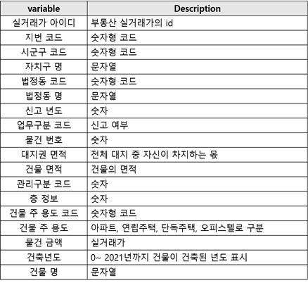

<br>

- dataframe 확인

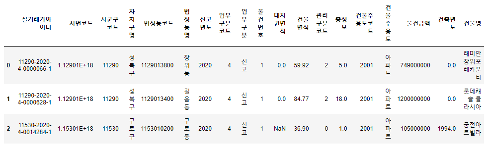

<br>

- Null값 확인

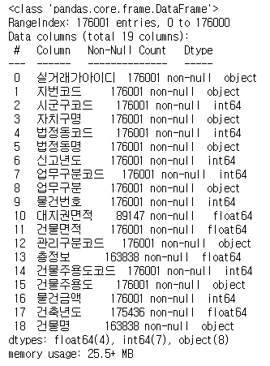

<br>

---

### 3. 데이터 전처리

- 데이터 시각화 - scatter plot

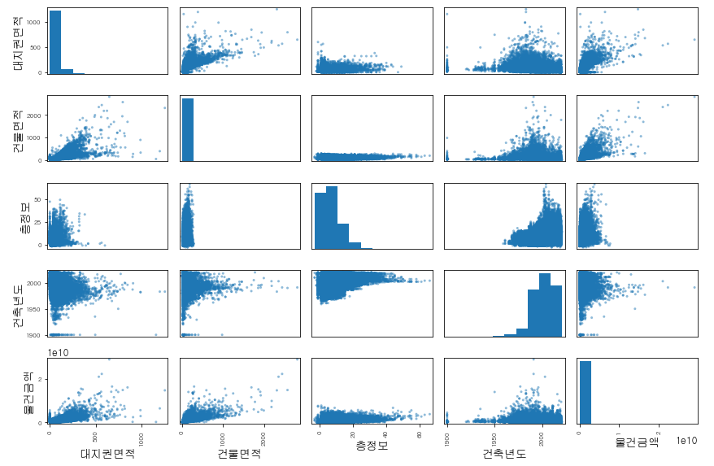

<br>

#### 1) 연속형 파이프라인 구축

```python
# 선택한 컬럼만 가져오기
from sklearn.base import BaseEstimator, TransformerMixin
from sklearn.pipeline import Pipeline
from sklearn.preprocessing import StandardScaler, MinMaxScaler
from datetime import datetime
from numpy import nan as NA 
from sklearn.base import BaseEstimator, TransformerMixin

class DataFrameSelector(BaseEstimator, TransformerMixin):
    def __init__(self, attribute_names):
        self.attribute_names = attribute_names
    def fit(self, X, y=None):
        return self
    def transform(self, X):
        return X[self.attribute_names].values
    
# 대지권면적, 층정보의 null 채워주기
land_area_ix, floor_ix = 0, 2  # 대지권면적, 층정보

class FillNullValue(BaseEstimator, TransformerMixin):
    def fit(self, X, y=None):
        return self  # nothing else to do
    def transform(self, X, y=None):
        for i in range(len(X)):
            if np.isnan(X[i,land_area_ix])==True:  # 대지권면적 0으로
                X[i,land_area_ix] = 0
            if np.isnan(X[i, floor_ix])==True:  # 층정보 1로
                 X[i, floor_ix] = 1
        return X
    

# 특성을 자동으로 추가해 주는 클래스 만들기 - 연식
# 건축년도 삭제후 건축년도 자리에 붙임
yr_built_ix = 3  # 건축년도 column

class CombinedAttributesAdder(BaseEstimator, TransformerMixin):
    def __init__(self, h_age = True): 
        self.h_age = h_age
    def fit(self, X, y=None):
        return self  # nothing else to do
    def transform(self, X, y=None):
        h_age = np.zeros(len(X))
       
        for i in range(len(X)):
            h_age[i] = datetime.today().year - X[i, yr_built_ix]
        
        return np.concatenate((np.delete(X, 3, axis=1), h_age.astype(int)[:,None]), axis=1)  # 건축년도 삭제
    
    
# 파이프라인 구축
num_attribs = list(housing_train_X.drop(["자치구명","건물주용도"], axis=1)) # categorical 변수 제외

num_pipeline = Pipeline([
        ('selector', DataFrameSelector(num_attribs)),
        ('fill_na', FillNullValue()),
        ('attribs_adder', CombinedAttributesAdder()),
        ('std_scaler', StandardScaler())
    ])

housing_num_tr = num_pipeline.fit_transform(housing_train_X)
```

<br>

#### 2) 전체 파이프라인

- 범주형 파이프라인 추가

```python
from sklearn.compose import ColumnTransformer  # 원래 만들어진 pipeline에 추가하기 위한 모듈
from sklearn.preprocessing import OneHotEncoder

num_attribs = list(housing_train_X)
cat_attribs = ['건물주용도','자치구명']

full_pipeline = ColumnTransformer([
    ("num", num_pipeline, num_attribs),
    ("cat", OneHotEncoder(categories='auto', sparse=False), cat_attribs),  # OneHotEncoder
])

housing_prepared = full_pipeline.fit_transform(housing_train_X)
print(housing_prepared.shape)
housing_prepared
```

<br>

#### 3) 최종 구축 데이터셋


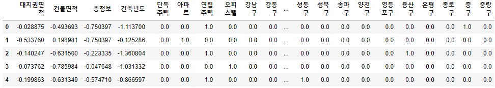

<br>

---

### 4. 모델링

#### 1) LinearRegression

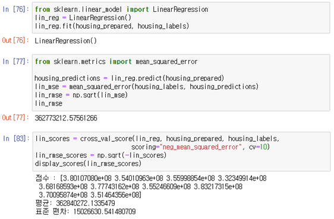

<br>

#### 2) DecisionTreeRegression

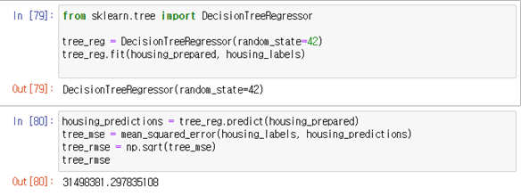

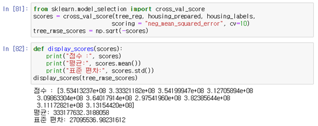

<br>

#### 3) RandomForest Regression

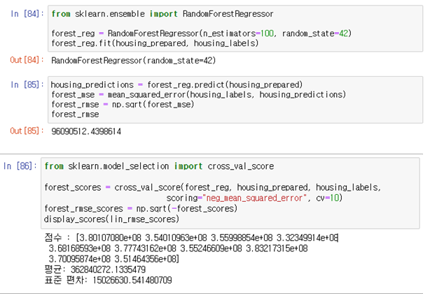

<br>

#### 4) RandomForest Regression with GridSearch

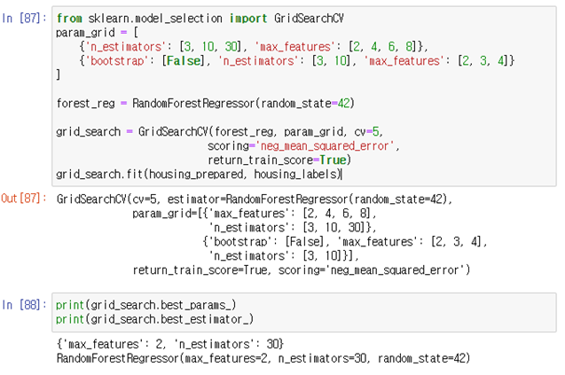

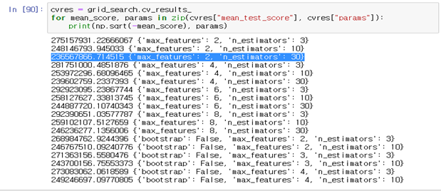

<br>

#### 5) RandomForest Regression with Random GridSearch

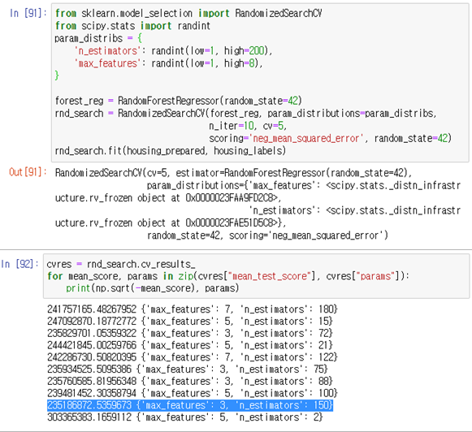

<br>

#### 6) 모델 선정

| **Model**                                   | **RMSE**    | **Rank**      |
| ------------------------------------------- | ----------- | ------------- |
| Linear  Regression                          | 362,773,212 | 6             |
| Linear Regression(cv)                       | 362,840,272 | 7             |
| DecisionTree  Regression                    | 31,498,381  | 1  (과대적합) |
| DecisionTree  Regression(cv)                | 333,177,632 | 5             |
| RandomForest  Regression                    | 96,090,512  | 2  (과대적합) |
| RandomForest  Regression(cv)                | 362,840,272 | 7             |
| RandomForest  Regression(gridSearch)        | 236,567,866 | 4             |
| RandomForest Regression (random gridSearch) | 235,186,872 | 3             |

<br>

---

### 5. 결론

- **개선사항**
  - 결측치 및 이상치 관련 전문가의 자문 부족
  - 새로운 특성 발굴 

- **추가 제언**
  - 추후 '동 별 지하철 개수' 데이터를 추가하여 예측 정확도 개선
  - '해당 물건과 한강과의 거리' 데이터를 추가하여 분석에 활용 가능

